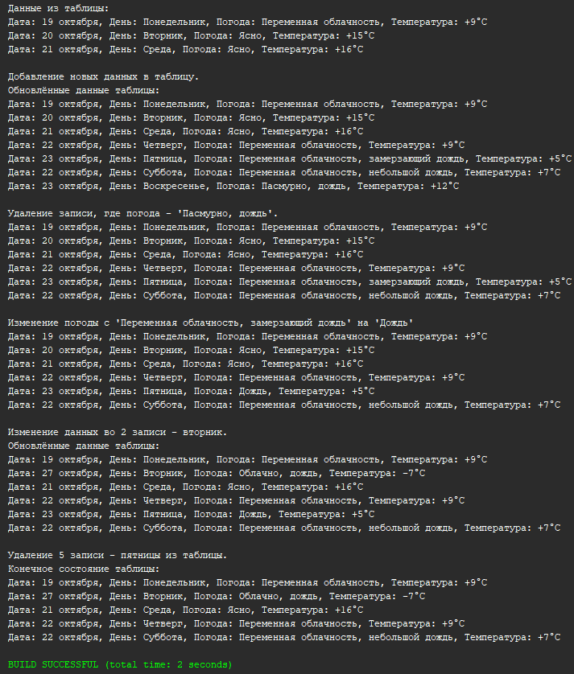

# BMK_Hibernate
## Решение 4 лабораторной работы
## Реализация программы с использованием технологии Hibernate и базы данных
## Вариант - 1 (Погода)

## Вывод


## Скрипт для создания таблицы:
```
CREATE TABLE IF NOT EXISTS `week` (
    `id` INT NOT NULL AUTO_INCREMENT,
    `date` VARCHAR(15) NOT NULL,
    `day` VARCHAR(11) NULL DEFAULT NULL,
    `weather` VARCHAR(45) NULL DEFAULT NULL,
    `temperature` VARCHAR(5) NULL DEFAULT NULL,
    PRIMARY KEY (`id`)
)  ENGINE=INNODB DEFAULT CHARSET=UTF8MB4 COLLATE = UTF8MB4_0900_AI_CI;

INSERT INTO week (date, `day`, weather, temperature) VALUES ("19 октября", "Понедельник", "Переменная облачность", "+9°C");
INSERT INTO week (date, `day`, weather, temperature) VALUES ("20 октября", "Вторник", "Ясно", "+15°C");
INSERT INTO week (date, `day`, weather, temperature) VALUES ("21 октября", "Среда", "Ясно", "+16°C");
```
